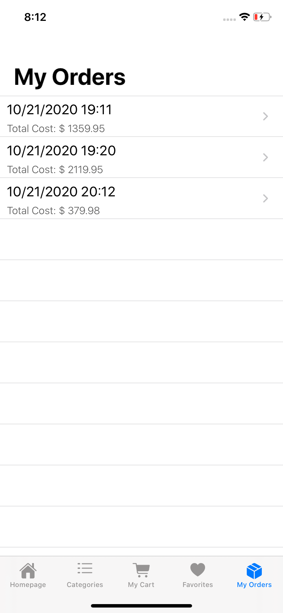

<h1 id="ecommerceApp">ECommerce App</h1>
<li> Products are shown in 4 different sale categories which are best sellers, most viewed, top rated, best prices and best offers which are on homepage</li>
 <li>  Products can be chosen according to category.</li> 
    <li>Category list helps to find product  which  is  searched</li>
    <li>  Products can be added or removed from favorites or cart. </li>

<h1 id="technologies-used">Technologies Used</h1>
<ul>
<li>UIKit</li>
<li>MVVM Design Pattern</li>
<li>Programmatic UI</li>
<li>UserDefaults</li>
<li>UICollectionView</li>
<li>Custom CollectionViewCell</li>
<li>UITableView</li>
<li>Custom TableViewCell</li>
<li>Custom UIAlert</li>
<li>Custom UILabel</li>
<li>Custom UIButton</li>
</ul>

<h1 id="compatibility">Compatibility</h1>

This project is written in Swift 5.0 and Xcode 11 is used.

<h1 id="images">Images</h1>

    

    

    
    

    
    

        

      

    

    

    

